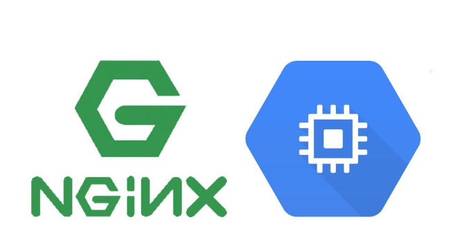

# Laboratorio 1: Creación de una Máquina Virtual con Nginx

Bienvenido al primer laboratorio de este repositorio, aquí aprenderás a crear una máquina virtual en Google Cloud Platform (GCP) y configurar Nginx como servidor web.

---

<!--{width=50%}-->

  

## Antes de comenzar
Antes de comenzar este laboratorio, es necesario que tengas una cuenta en GCP y conozcas los conceptos básicos de la plataforma.

## Objetivo
El objetivo de este laboratorio es aprender a crear una máquina virtual en GCP y configurar Nginx como servidor web.

## Instrucciones
1. Asegúrate de tener acceso a la CLI de GCP.
2. Abre la consola de cloud shell en GCP.
3. Clona este repositorio y accede a la carpeta "Lab_1: Creación de una Máquina Virtual con Nginx".
4. Ejecuta el script "create_vm.sh" para crear una máquina virtual con el tráfico de http habilitado.
5. Verifica que Nginx está corriendo y que puedes acceder a él desde el navegador web.

## Validaciones
Para poder validar el resultado del Lab puedes realizar lo siguiente

`gcloud compute instances list` -> Listará las instancias creadas en el proyecto en donde estemos parados

`gcloud compute instances list --filter="name=vmprb-nginx01 AND zone:us-central1-b"` -> Con esto podemos ser más específicos para filtrar la máquina

`gcloud compute instances describe vmprb-nginx01` -> De esta forma podemos describir la vm

Para validar el servidor nginx podemos hacer lo siguiente:

- Primero obtener la ip de la vm y almacenarla en la variable vm_ip

    `vm_ip=$(gcloud compute instances describe vmprb-nginx01 --zone us-central1-b --format='value(networkInterfaces[0].accessConfigs[0].natIP)')`

- Después ejecutar una petición con la utilidad de curl para ver si responde

    `curl http://$vm_ip:80`

Si se desea realizar las validaciones de forma automática, entonces sólo ejecutar el script `validar_lab.sh`

curl http://$vm_ip:80

## Archivos
Este laboratorio incluye los siguientes archivos:
- `create_vm.sh`: script para crear una máquina virtual en GCP con el tráfico de http habilitado.
- `install_nginx.sh`: script para instalar Nginx en la máquina virtual recién creada.
- `validar_lab.sh`: Valida que se hayan completado los objetivos del lab correctamente
- `limpiar_lab.sh`: Este script ayuda e aliminar los recursos aprovisionados en este lab y evitar cargos extras en nuestra cuenta

---

## Ayuda de Comandos utilizados

- `gcloud compute instances create`: Este comando se usa para crear una máquina virtual en Google Cloud.

    Las banderas utilizadas en este comando son las siguientes:

    --`image-family`: Especifica la familia de imágenes que se usará para crear la máquina virtual. En este caso, se está utilizando ubuntu-2004-lts.

    --`image-project`: Especifica el proyecto en el que se encuentra la imagen de la máquina virtual. En este caso, se está utilizando ubuntu-os-cloud.

    --`create-disk`: Especifica el tamaño del disco que se creará para la máquina virtual. En este caso, se está utilizando size=10GB.

    --`metadata-from-file`: Especifica el script que se ejecutará al inicio de la máquina virtual. En este caso, se está utilizando startup-script=install_nginx.sh, para poder realizar la instalación del nginx.

    --`preemptible`: Especifica que la máquina virtual es preemptible, lo que significa que puede ser interrumpida en cualquier momento.

    --`boot-disk-size`: Especifica el tamaño del disco de arranque de la máquina virtual. En este caso, se está utilizando 10GB.

    --`boot-disk-type`: Especifica el tipo de disco de arranque de la máquina virtual. En este caso, se está utilizando pd-standard.

    --`tags`: Especifica una etiqueta que se asignará a la máquina virtual. En este caso, se está utilizando http-server. Esto nos servirá para poder hacer referencia a la máquina en la firewal-rule

    --`zone`: Especifica la zona en la que se creará la máquina virtual. En este caso, se está utilizando us-central1-b.

- `gcloud compute firewall-rules create`: Este comando se usa para crear una regla de firewall que permita el tráfico HTTP a la máquina virtual.

    `gcloud compute firewall-rules create allow-http`: Crea una regla de firewall llamada allow-http
    
    --`allow tcp:80`: Permite el tráfico TCP en el puerto 80

    --`target-tags http-server`: Aplica la regla de firewall a las máquinas virtuales con la etiqueta http-server
    
    --`source-ranges` 0.0.0.0/0: Permite el acceso desde cualquier dirección IP
    
    --`description` "Allow HTTP traffic": Agrega una descripción para la regla de firewall

---

## Conclusiones
Al finalizar este laboratorio, habrás aprendido a crear una máquina virtual en GCP y configurar Nginx como servidor web. Esto es un paso importante para poder desplegar aplicaciones web en la nube.

