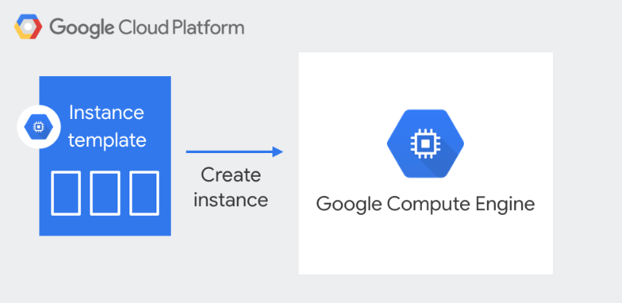

# Laboratorio 3: Creación de Instance Templates

Bienvenido al laboratorio "Creación de Instance Templates". En este laboratorio, aprenderás a crear y administrar plantillas de instancia de compute Engine en Google Cloud Platform (GCP). Las plantillas de instancia te permiten definir y configurar una instancia de manera repetible, lo que puede ahorrar tiempo y esfuerzo en la creación y administración de instancias en GCP

---


<p align="center">
  
</p>


## Antes de comenzar
Antes de comenzar este laboratorio, es necesario que tengas una cuenta en GCP y conozcas los conceptos básicos de la plataforma.

## Objetivo
En este lab, aprenderás cómo crear, configurar y utilizar plantillas de instancias de Google Compute Engine para automatizar la creación de instancias de VMs.

Después de completar este lab, podrás:

Crear una plantilla de instancia de Compute Engine.
Configurar la plantilla con valores predeterminados para instancias de VM.
Utilizar la plantilla para crear instancias de VM de manera automatizada.


## Instrucciones
1. Asegúrate de tener acceso a la CLI de GCP.
2. Abre la consola de cloud shell en GCP.
3. Clona este repositorio y accede a la carpeta "Lab3_Instance_Templates/scripts".

4. Crear la plantilla de instancia con el siguiente comando

```
gcloud compute instance-templates create imagen1-webserver \
--metadata-from-file startup-script=instala_apache.sh \
--machine-type e2-micro \
--image projects/debian-cloud/global/images/debian-11-bullseye-v20230206 \
--tags http-server \
--boot-disk-size 10 \
--boot-disk-type pd-balanced 
```

 usaremos el script `instala_apache.sh` del repositorio clonado, para la instalación del apache server y la generación de una pequeña página de inicio del servidor.

5. Listar la Instance Template

Para verificar que se ha creado correctamente la Instance Template, se puede listar con el siguiente comando.

`gcloud compute instance-templates list`

6. Para ver los detalles de la Instance Template, se puede usar el siguiente comando:

`gcloud compute instance-templates describe imagen1-webserver`

7. Demostrar la ventaja de tener una Instance Template

Una vez creada la Instance template es muy sencillo poder generar máquinas virtuales con GCE de la siguiente forma:

```
gcloud compute instances create web-server-prb1 \
--source-instance-template=imagen1-webserver \
--zone=us-central1-a
```

Y podemos generar otra vm exactamente igual en una zona diferente

```
gcloud compute instances create web-server-prb2 \
--source-instance-template=imagen1-webserver \
--zone=us-central1-b
```

8. Para verificar que las Maquina virtuales fueron creadas satisfactoriamente puedes realizar lo siguiente:


9. Además de verificar que existan, podemos hacer una petición http a la máquina para ver que responda el Apache. Para poder hacer estas peticiones a estas instancias, es necesario abrir el tráfico por el puerto 80 mediante la siguiente firewall-rule. Es importante que coincida el network-tag con el asignado en la instance template.

```
gcloud compute firewall-rules create allow-http \
  --allow tcp:80 \
  --target-tags http-server \
  --source-ranges 0.0.0.0/0 \
  --description "Allow HTTP traffic"
```

10. Ahora si primero necesitamos obtener la ip de una de las máquinas y la guardaremos en una variable de ambiente de nombre ip_addres

```
ip_address=$(gcloud compute instances describe "web-server-prb1" --zone "us-central1-a" --format='value(networkInterfaces[0].accessConfigs[0].natIP)')
```

y verificamos que la variable si contenga la ip mediante 

`echo $ip_address`

11. Ahora hacemos una petición mediante curl para ver que nos conteste correctamente.

`curl http://$ip_address:80`

## ***¡Felicidades!***

Ahora ya has comprendido el usa y la aplicación de las intance templates en Google Cloud Platform.


## Archivos
Este laboratorio incluye los siguientes archivos:
- `instala_apache.sh`: script para instalar apache y generar el index.html de inicio que tendran las vms.
- `validar_lab.sh`: Valida que se hayan completado los objetivos del lab correctamente
- `limpiar_lab.sh`: Este script ayuda e aliminar los recursos aprovisionados en este lab y evitar cargos extras en nuestra cuenta

---

## Ayuda de Comandos utilizados

- `gcloud compute instance-templates create`: Este comando permite la creación de plantillas de instancia de VM en Google Cloud. Con este comando se pueden especificar varias opciones de configuración para la instancia, como la imagen del sistema operativo, la configuración de red, las opciones de inicio automático y mucho más. 

Algunas banderas útiles para este comando son:

`--image`: para especificar la imagen del sistema operativo que se utilizará para la instancia.

`--machine-type`: para especificar el tipo de máquina virtual que se utilizará.

`--network-interface`: para especificar la configuración de red de la instancia.

`--tags`: para especificar las etiquetas de red que se asignarán a la instancia.

`--metadata-from-file startup-script`: Para indicar el script de inicio de la vm que se utilizará.


 La lista completa de opciones está disponible en la documentación de gcloud: https://cloud.google.com/sdk/gcloud/reference/compute/instance-templates/create.


- `gcloud compute instances create`: Este comando sirve para para crear una instancias de VM y se debe de utilizar la bandera `--source-instance-template=nombre-instance-template` para indicar que la vm se construirá a partir de una instance template.


---

## Conclusiones
Al finalizar este laboratorio, habrás aprendido a crear, manejar y utilizar instance templates en Google Cloud Platform. Podrás crear plantillas de instancias personalizadas que te permitan replicar rápidamente una configuración específica en múltiples máquinas virtuales. Con este conocimiento, podrás aumentar la eficiencia en la creación y gestión de máquinas virtuales en Google Cloud.
