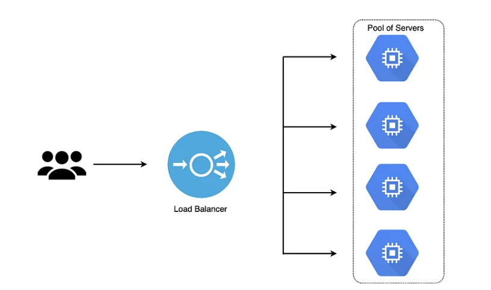

# Laboratorio 4: Creación de un Balanceador de Cargas de Red

Bienvenido al laboratorio "Creación de Balanceador de Carga de Red". En este laboratorio, aprenderás a crear y administrar Balanceadores de Carga de Red (LB) en Google Cloud Platform (GCP). Éstos te permiten distribuir el tráfico de red de manera equilibrada entre tus instancias de Compute Engine, lo que ayuda a mejorar la escalabilidad y la disponibilidad de tus aplicaciones.

Un Load Balancer de Red trabaja en la capa 4 (Capa de transporte del modelo OSI), por lo que es capaz de distribuir el tráfico de red de manera equilibrada entre las instancias de Compute Engine independientemente del protocolo de aplicación utilizado (usa los puertos para distribuir), lo que lo hace ideal para aplicaciones que no utilizan HTTP o HTTPS. Además, al trabajar a nivel de red, un Load Balancer de Red es capaz de distribuir el tráfico de manera más eficiente y con menos sobrecarga que un Load Balancer HTTP/HTTPS, lo que lo hace ideal para aplicaciones con altos volúmenes de tráfico.

---


<p align="center">
  
</p>


## Antes de comenzar
Antes de comenzar este laboratorio, es necesario que tengas una cuenta en GCP y conozcas los conceptos básicos de la plataforma.

## Objetivo
En este lab, aprenderás cómo crear y configurar un balanceador de carga de red para distribuir el trabajo en diferentes máquinas virtuales de GCE. También aprenderás a crear algunos de los recursos necesarios para poder poner en marcha el LB tales como:

  - Una Ip Externa estática
  - Un recurso de verificación de estado (health-check)
  - Un grupo de destino (target-pool) que servirá para agregar las VMs
  - Y una regla de reenvío (forwarding-rule), que nos servirá para enrutar el tráfico del LB a las VMs


Después de completar este lab, podrás:

Tener los conocimientos para crear los recursos necesarios para poner en marcha un Balanceador de carga de Red.
Entender el uso y aplicación de un Balanceador de carga de Red.

## Instrucciones


Este Lab tiene dos modalidades: 

---
### Modalidad Paso a Paso

Ejecutar de forma manual cada una de las instrucciones, lo que permite visualizar y explorar el avance desde la consola. Para ello ejecuta los siguientes pasos:


### Creación de un Máquina Virtual (VM)

1. Acceder a la consola de Google Cloud Platform y abrir Cloud Shell.

2. En Cloud shell, configurar  la zona predeterminada:

`gcloud config set compute/zone us-east1-d`

3. Configurar la region predeterminada:

`gcloud config set compute/region us-east1`


### Creación de 3 Máquinas Virtuales como Servidores Web

4. Crear la instancia vm-webserver1 en GCE :

```
gcloud compute instances create vm-webserver1 \
    --zone=us-east1-d \
    --tags=network-lb-tag \
    --machine-type=e2-small \
    --image-family=debian-11 \
    --image-project=debian-cloud \
    --metadata=startup-script='#!/bin/bash
      apt-get update
      apt-get install apache2 -y
      service apache2 restart
      echo "
<h3>  ESTÁS EN EN EL SERVIDOR WEB NÚMERO 1.   </h3>" | tee /var/www/html/index.html'
```


5. Crear la instancia vm-webserver2 en GCE :

```
gcloud compute instances create vm-webserver2 \
    --zone=us-east1-d \
    --tags=network-lb-tag \
    --machine-type=e2-small \
    --image-family=debian-11 \
    --image-project=debian-cloud \
    --metadata=startup-script='#!/bin/bash
      apt-get update
      apt-get install apache2 -y
      service apache2 restart
      echo "
<h3>  ESTÁS EN EN EL SERVIDOR WEB NÚMERO 2.   </h3>" | tee /var/www/html/index.html'
```


6. Crear la instancia vm-webserver3 en GCE :

```
gcloud compute instances create vm-webserver3 \
    --zone=us-east1-d \
    --tags=network-lb-tag \
    --machine-type=e2-small \
    --image-family=debian-11 \
    --image-project=debian-cloud \
    --metadata=startup-script='#!/bin/bash
      apt-get update
      apt-get install apache2 -y
      service apache2 restart
      echo "
<h3>  ESTÁS EN EN EL SERVIDOR WEB NÚMERO 3.   </h3>" | tee /var/www/html/index.html'
```


7. Ahora crearemos una regla de firewall para permitir la entrada del tráfico externo a cada una de las instancias. Ésto se logra mediante el tag "network-lb-tag" que se asignó a cada una de las instancias. Y se abre el tráfico tcp por el puerto 80.

```
gcloud compute firewall-rules create www-firewall-network-lb \
    --target-tags network-lb-tag --allow tcp:80
``` 

8. Ahora necesitamos obtener las ips de cada una de las instancias, esto lo podemos hacer de la siguiente forma:

`vm_ip=$(gcloud compute instances describe vm-webserver1 --zone us-east1-d --format='value(networkInterfaces[0].accessConfigs[0].natIP)')`

9. Y hacemos una petición mediante Curl a cada una de las instancias para verificar que estén respondiendo correctamente

`curl http://$vm_ip`

### Configurar el servicio de balanceo de cargas de Red

1. Crea una dirección IP externa estática para el balanceador de cargas:

`gcloud compute addresses create network-lb-ip-1 --region us-east1`

2. Agregar un recurso de verificación de estado (health-check):

`gcloud compute http-health-checks create basic-check`

3. Crear un grupo de destino en la misma región que las instancias. Con el siguiente comando para crear el grupo de destino www-pool y se le indicará que va a utilizar la verificación de estado basic-check:

```
gcloud compute target-pools create www-pool \
    --region us-east1 --http-health-check basic-check 
```

4. Agregar las instancias al grupo de destino (target pool) www-pool :

```
gcloud compute target-pools add-instances www-pool \
    --instances vm-webserver1,vm-webserver2,vm-webserver3
```

5. Agregar una regla de reenvío, para indicar como se enrutará el tráfico desde la ip estática hacia las instancias que están en el target pool www-pool:

```
gcloud compute forwarding-rules create www-rule \
    --region  us-east1 \
    --ports 80 \
    --address network-lb-ip-1 \
    --target-pool www-pool
```

### Comenzar a mandar tráfico a las instancias, mediante la ip estática

Ahora que ya tienes todo configurado para el servicio de balanceo de cargas, podemos comenzar a enviar tráfico a la ip estática externa y ver cómo se distribuye el tráfico a las diferentes instancias.

1. Ingresa el siguiente comando para ver la dirección IP externa de la regla de reenvío www-rule que usa el balanceador de cargas:

`gcloud compute forwarding-rules describe www-rule --region us-east1`

2. Almacenaremos la dirección IP externa en una variable de entorno:

`IPEXTERNA_LB=$(gcloud compute forwarding-rules describe www-rule --region us-east1 --format="json" | jq -r .IPAddress)`

3. Muestra la dirección IP externa:

`echo $IPEXTERNA_LB`

4.- Utilizaremos el comando curl para acceder a la dirección IP externa y veamos que contenido nos entrega en diferentes peticiones

`for ((i=1; i<=10; i++)); do curl -m1 $IPEXTERNA_LB; done`

La respuesta del comando curl se alterna de manera aleatoria entre las tres instancias. Si al principio la respuesta es incorrecta, esperar unos segundos a que toda la configuración se cargue por completo y las instancias estén en buen estado antes de volver a intentarlo.


## ***¡Felicidades!***

Ahora ya has entendido como crear y configurar un Balanceador de Carga de Red y has podido comprobar como se realiza la distribución de tráfico desde una misma IP a cada una de las instancias que tenemos como servidores Web.


------------------------- pendiente de hacer la parte automática --------------------------------

---
### Modalidad Automática

Ejecutar de forma automática mediante un shell script. Lo que permitirá ver el resultado del laboratorio, pero realizandolo de forma automática mediante un script. Para ello ejecuta los siguientes pasos:


1. Asegúrate de tener acceso a la CLI de GCP.
2. Abre la consola de cloud shell en GCP.
3. Clona este repositorio y accede a la carpeta "Lab_1: Creación de una Máquina Virtual con Nginx".
4. Ejecuta el script "create_vm.sh" para crear una máquina virtual con el tráfico de http habilitado.
5. Verifica que Nginx está corriendo y que puedes acceder a él desde el navegador web.

## Validaciones


Si se desea realizar las validaciones de forma automática, entonces sólo ejecutar el script `validar_lab.sh`


## Archivos
Este laboratorio incluye los siguientes archivos:
- `create_vm.sh`: script para crear una máquina virtual en GCP con el tráfico de http habilitado.
- `install_nginx.sh`: script para instalar Nginx en la máquina virtual recién creada.
- `validar_lab.sh`: Valida que se hayan completado los objetivos del lab correctamente
- `limpiar_lab.sh`: Este script ayuda e aliminar los recursos aprovisionados en este lab y evitar cargos extras en nuestra cuenta

---

## Ayuda de Comandos utilizados

- `gcloud compute instances create`: Este comando se usa para crear una máquina virtual en Google Cloud.

    Las banderas utilizadas en este comando son las siguientes:

    --`image-family`: Especifica la familia de imágenes que se usará para crear la máquina virtual. En este caso, se está utilizando ubuntu-2004-lts.

    --`image-project`: Especifica el proyecto en el que se encuentra la imagen de la máquina virtual. En este caso, se está utilizando ubuntu-os-cloud.

    --`create-disk`: Especifica el tamaño del disco que se creará para la máquina virtual. En este caso, se está utilizando size=10GB.

    --`metadata-from-file`: Especifica el script que se ejecutará al inicio de la máquina virtual. En este caso, se está utilizando startup-script=install_nginx.sh, para poder realizar la instalación del nginx.

    --`preemptible`: Especifica que la máquina virtual es preemptible, lo que significa que puede ser interrumpida en cualquier momento.

    --`boot-disk-size`: Especifica el tamaño del disco de arranque de la máquina virtual. En este caso, se está utilizando 10GB.

    --`boot-disk-type`: Especifica el tipo de disco de arranque de la máquina virtual. En este caso, se está utilizando pd-standard.

    --`tags`: Especifica una etiqueta que se asignará a la máquina virtual. En este caso, se está utilizando http-server. Esto nos servirá para poder hacer referencia a la máquina en la firewal-rule

    --`zone`: Especifica la zona en la que se creará la máquina virtual. En este caso, se está utilizando us-central1-b.


- `gcloud compute firewall-rules create`: Este comando se usa para crear una regla de firewall que permita el tráfico HTTP a la máquina virtual.


    `gcloud compute firewall-rules create allow-http`: Crea una regla de firewall llamada allow-http
    
    --`allow tcp:80`: Permite el tráfico TCP en el puerto 80

    --`target-tags http-server`: Aplica la regla de firewall a las máquinas virtuales con la etiqueta http-server
    
    --`source-ranges` 0.0.0.0/0: Permite el acceso desde cualquier dirección IP
    
    --`description` "Allow HTTP traffic": Agrega una descripción para la regla de firewall

---

## Conclusiones
Al finalizar este laboratorio, habrás aprendido a crear una máquina virtual en GCP y configurar Nginx como servidor web. Esto es un paso importante para poder desplegar aplicaciones web en la nube.

