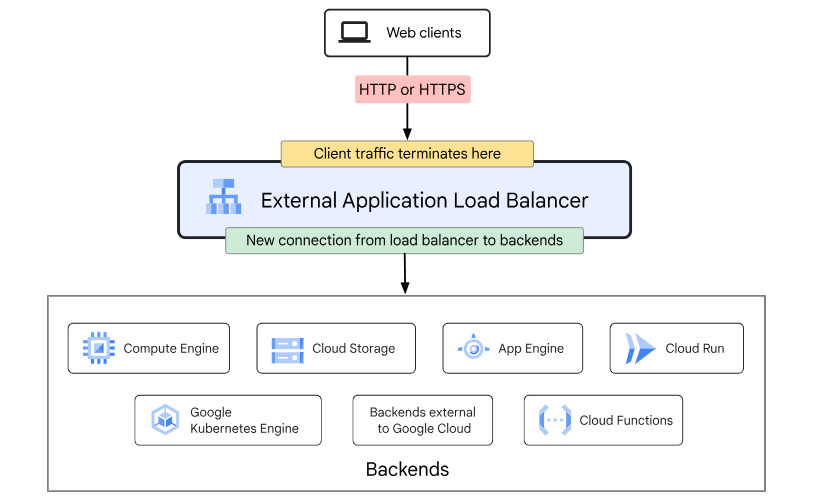
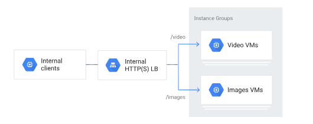
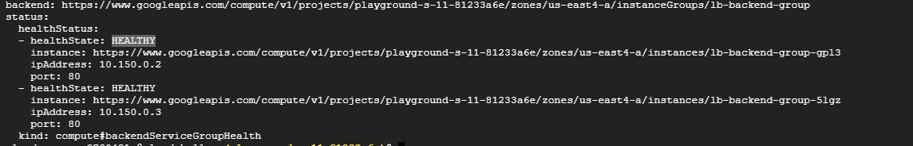

# Laboratorio 5: Creación de un Balanceador de Cargas de Aplicación (http)

Bienvenido al laboratorio "Creación de Balanceador de cargas de aplicación". En este laboratorio, aprenderás a crear y administrar Application Load Balancers en Google Cloud Platform (GCP). Estos Load Balancers te permiten distribuir el tráfico de red de manera equilibrada entre tus instancias de Compute Engine, lo que mejora la escalabilidad y disponibilidad de tus aplicaciones.

Un Application Load Balancer trabaja en la capa 7 (Capa de aplicación del modelo OSI), lo que le permite distribuir el tráfico de manera equilibrada basándose en información más específica de la aplicación, como las URL, las cookies o los encabezados HTTP. Esto lo convierte en una excelente opción para aplicaciones basadas en HTTP o HTTPS.

Además de la distribución de tráfico, un Application Load Balancer ofrece funciones avanzadas, como el enrutamiento basado en contenido y la administración de sesiones. Puedes configurar reglas de enrutamiento para redirigir el tráfico a instancias específicas en función de las necesidades de tu aplicación. Además, el Application Load Balancer puede administrar sesiones y mantener la persistencia del estado durante las conexiones, lo que resulta útil para aplicaciones que requieren que un usuario se conecte siempre a la misma instancia.

Al trabajar a nivel de aplicación, el Application Load Balancer puede inspeccionar y modificar el tráfico antes de enviarlo a las instancias de Compute Engine. Esto permite realizar tareas como la terminación SSL (Secure Sockets Layer) o la adición de encabezados personalizados.

---


<p align="center">
  
</p>

<p align="center">
  Arquitectura del balanceador de cargas de aplicaciones externo.
</p>


<p align="center">
  
</p>

<p align="center">
  Arquitectura basado en rutas con balanceadores de cargas de aplicaciones internos.
</p>

## Antes de comenzar
Antes de comenzar este laboratorio, es necesario que tengas una cuenta en GCP y conozcas los conceptos básicos de la plataforma.

## Objetivo
En este lab, aprenderás cómo crear y configurar un balanceador de carga de aplicación para distribuir el trabajo en diferentes máquinas virtuales de GCE. También aprenderás a crear algunos de los recursos necesarios para poder poner en marcha el LB tales como:

  - Una plantilla de instancias
  - Un grupo de instancias administrado (que usará  la plantilla de instancias)
  - Una regla de firewall
  - Una Ip Externa estática
  - Un recurso de verificación de estado (health-check)
  - Un servicio de backend, que es a donde se mandará el tráfico desde el LB (a éste será asociado el grupo de instancias)
  - Un mapa de URLs, que servirá para enrutar las solicitudes entrantes al servicio de backend indicado
  - Crea un Proxy HTTP de destino, que servirá para enrutar las solicitudes al mapa de URLs
  - Una regla de reenvío global, que servirá para enrutar las solicitudes entrantes al proxy

  
Después de completar este lab, podrás:

Tener los conocimientos para crear los recursos necesarios para poner en marcha un Balanceador de aplicación.
Entender el uso y aplicación de un Balanceador de aplicación (http).

## Instrucciones


Este Lab tiene dos modalidades: 

---
### Modalidad Paso a Paso

Ejecutar de forma manual cada una de las instrucciones, lo que permite visualizar y explorar el avance desde la consola. Para ello ejecuta los siguientes pasos:


### Creación de recursos para el Load Balancer de aplicación

1. Crear la plantilla que se usará para el balanceador de cargas:

```
gcloud compute instance-templates create lb-backend-template \
   --region=us-east4 \
   --network=default \
   --subnet=default \
   --tags=allow-health-check \
   --machine-type=e2-medium \
   --image-family=debian-11 \
   --image-project=debian-cloud \
   --metadata=startup-script='#!/bin/bash
     apt-get update
     apt-get install apache2 -y
     a2ensite default-ssl
     a2enmod ssl
     vm_hostname="$(curl -H "Metadata-Flavor:Google" \
     http://169.254.169.254/computeMetadata/v1/instance/name)"
     echo "Página mostrada desde la vm: $vm_hostname" | \
     tee /var/www/html/index.html
     systemctl restart apache2'
```

2. Crea un grupo de instancias administrado basado en la plantilla:

```
gcloud compute instance-groups managed create lb-backend-group \
   --template=lb-backend-template --size=2 --zone=us-east4-a 
```

3. Crea una regla de firewall que nos servirá para permitir el acceso del health check a las vms.

```
gcloud compute firewall-rules create fw-allow-health-check \
  --network=default \
  --action=allow \
  --direction=ingress \
  --source-ranges=130.211.0.0/22,35.191.0.0/16 \
  --target-tags=allow-health-check \
  --rules=tcp:80
```

Nota: La regla de entrada permite el tráfico de los sistemas de verificación de estado de Google Cloud (130.211.0.0/22 y 35.191.0.0/16). Con la etiqueta de destino allow-health-check podremos identificar las vms a las que afectará la regla.


4. Ahora es necesario configurar una dirección IP externa, estática y global que usarán los usuarios para llegar al balanceador de cargas:

```
gcloud compute addresses create lb-ipv4-1 \
  --ip-version=IPV4 \
  --global
```

Con la siguiente instrucción podemos obtener la dirección ip 

```
gcloud compute addresses describe lb-ipv4-1 \
  --format="get(address)" \
  --global
```

5. Crea una verificación de estado para el balanceador de cargas:

```
gcloud compute health-checks create http http-basic-check \
  --port 80
```

6. Crea un servicio de backend:

```
gcloud compute backend-services create web-backend-service \
  --protocol=HTTP \
  --port-name=http \
  --health-checks=http-basic-check \
  --global
```

7. Agrega tu grupo de instancias como backend al servicio de backend:

```
gcloud compute backend-services add-backend web-backend-service \
  --instance-group=lb-backend-group \
  --instance-group-zone=us-east4-a \
  --global
```

8. Crea un mapa de URLs para enrutar las solicitudes entrantes al servicio de backend predeterminado:

```
gcloud compute url-maps create web-map-http \
    --default-service web-backend-service
```

9. Crea un Proxy HTTP de destino para enrutar las solicitudes a tu mapa de URLs:

```
gcloud compute target-http-proxies create http-lb-proxy \
    --url-map web-map-http
```

10. Crea una regla de reenvío global para enrutar las solicitudes entrantes al proxy:

```
gcloud compute forwarding-rules create http-content-rule \
    --address=lb-ipv4-1\
    --global \
    --target-http-proxy=http-lb-proxy \
    --ports=80
```


### Prueba el tráfico enviado al balanceador y de ahí a las instancias.

Ahora que ya tienes todo configurado para el servicio de balanceo de cargas, podemos comenzar a enviar tráfico a la ip estática externa y ver cómo se distribuye el tráfico a las diferentes instancias.

### Validar que las VMs que conforman el Backend del balanceador de carga están en buen estado

1. Primero obtendremos el nombre del backend de nuestro load_balancer de nombre web-map-http y lo almacenaremos en una variable

`BACKEND_NAME=$(gcloud compute url-maps describe web-map-http --format="value(defaultService.basename())")`

2. Validamos que el nombre se haya obtenido correctamente

`echo $BACKEND_NAME`

3. Ahora si podemos obtener la salud de las instancias del backend con la siguiente instrucción

`gcloud compute backend-services get-health $BACKEND_NAME  --global`


La salida debe de verse de forma similar a la siguiente imagen.

<p align="center">
  
</p>

4. Almacenaremos la dirección IP externa en una variable de entorno:

`IPEXTERNA_LB=$(gcloud compute forwarding-rules describe http-content-rule --global --format="value(IPAddress)")`

3. Muestra la dirección IP externa:

`echo $IPEXTERNA_LB`

4.- Utilizaremos el comando curl para acceder a la dirección IP externa y veamos que contenido nos entrega en diferentes peticiones

`for ((i=1; i<=10; i++)); do curl -m1 $IPEXTERNA_LB; done`

La respuesta del comando curl se alterna de manera aleatoria entre las tres instancias. Si al principio la respuesta es incorrecta, esperar unos segundos a que toda la configuración se cargue por completo y las instancias estén en buen estado antes de volver a intentarlo.


## ***¡Felicidades!***

Ahora ya has entendido como crear y configurar un Balanceador de Carga de aplicación y has podido comprobar como se realiza la distribución de tráfico desde una misma IP a cada una de las instancias que tenemos como backend.


---
### Modalidad Automática

Ejecutar de forma automática mediante un shell script. Lo que permitirá ver el resultado del laboratorio, pero realizandolo de forma automática mediante un script. Para ello ejecuta los siguientes pasos:


1. Asegúrate de tener acceso a la CLI de GCP.
2. Abre la consola de cloud shell en GCP.
3. Clona este repositorio y accede a la carpeta "Lab5_Apllication_LB".
4. Ejecuta el script `create_application_lb.sh` para crear todos los recursos necesarios para probar el load balancer de aplicación.
5. Verifica que puedas accesar a las vms desde un navegador y que también puedas acceder al LB con la IP estática generada.

## Validaciones


Si se desea realizar las validaciones de forma automática, entonces sólo ejecutar el script `validar_lab.sh`


## Archivos
Este laboratorio incluye los siguientes archivos:
- `create_application_lb.sh`: script para crear los recursos necesarios para el Load Balancer de Aplicación
- `validar_lab.sh`: Valida que se hayan completado los objetivos del lab correctamente
- `limpiar_lab.sh`: Este script ayuda e aliminar los recursos aprovisionados en este lab y evitar cargos extras en nuestra cuenta

---

## Ayuda de Comandos utilizados

- `gcloud compute instances create`: Este comando se usa para crear una máquina virtual en Google Cloud.

    Las banderas utilizadas en este comando son las siguientes:

    `--image-family`: Especifica la familia de imágenes que se usará para crear la máquina virtual. En este caso, se está utilizando ubuntu-2004-lts.

    `--image-project`: Especifica el proyecto en el que se encuentra la imagen de la máquina virtual. En este caso, se está utilizando ubuntu-os-cloud.

    `--create-disk`: Especifica el tamaño del disco que se creará para la máquina virtual. En este caso, se está utilizando size=10GB.

    `--metadata-from-file`: Especifica el script que se ejecutará al inicio de la máquina virtual. En este caso, se está utilizando startup-script=install_nginx.sh, para poder realizar la instalación del nginx.

    `--preemptible`: Especifica que la máquina virtual es preemptible, lo que significa que puede ser interrumpida en cualquier momento.

    `--boot-disk-size`: Especifica el tamaño del disco de arranque de la máquina virtual. En este caso, se está utilizando 10GB.

    `--boot-disk-type`: Especifica el tipo de disco de arranque de la máquina virtual. En este caso, se está utilizando pd-standard.

    `--tags`: Especifica una etiqueta que se asignará a la máquina virtual. En este caso, se está utilizando http-server. Esto nos servirá para poder hacer referencia a la máquina en la firewal-rule

    `--zone`: Especifica la zona en la que se creará la máquina virtual. En este caso, se está utilizando us-central1-b.


- `gcloud compute firewall-rules create`: Este comando se usa para crear una regla de firewall que permita el tráfico HTTP a la máquina virtual.


    `gcloud compute firewall-rules create allow-http`: Crea una regla de firewall llamada allow-http

    Las banderas utilizadas en este comando son las siguientes:
    
    `--allow tcp:80`: Permite el tráfico TCP en el puerto 80

    `--target-tags http-server`: Aplica la regla de firewall a las máquinas virtuales con la etiqueta http-server
    
    `--source-ranges` 0.0.0.0/0: Permite el acceso desde cualquier dirección IP
    
    `--description` "Allow HTTP traffic": Agrega una descripción para la regla de firewall


- `gcloud compute addresses create network-lb-ip-1`: Crea una dirección IP estática llamada network-lb-ip-1

    Las banderas utilizadas en este comando son las siguientes:

  `--region us-central1`: Especifica la región donde se creará la dirección IP estática.

  `--description "Mi IP estática"`: Agrega una descripción para la dirección IP estática.

  `--subnet my-subnet`: Asocia la dirección IP estática con la subred llamada my-subnet.

  `--project my-project`: Especifica el proyecto donde se creará la dirección IP estática.


- `gcloud compute http-health-checks create basic-check`: Este comando se utiliza para crear un Health Check de HTTP de nombre basic-check.

    Las banderas que podemos utilizar con este comando son las siguientes:

  `--port`: Especifica el puerto en el que se realizará la comprobación de salud. En este caso, se utiliza el puerto 80.

  `--request-path`: Especifica la ruta del recurso que se utilizará para la comprobación de salud. En este caso, se utiliza /health.

  `--check-interval`: Especifica el intervalo de tiempo en segundos entre cada comprobación de salud. En este caso, se utiliza un intervalo de 5 segundos.

  `--timeout`: Especifica el tiempo máximo en segundos para esperar una respuesta del recurso en la comprobación de salud. En este caso, se utiliza un tiempo de espera de 5 segundos.

  `--unhealthy-threshold`: Especifica el número de comprobaciones consecutivas fallidas antes de considerar el recurso como no saludable. En este caso, se utiliza un umbral de 3 comprobaciones fallidas.

  `--healthy-threshold`: Especifica el número de comprobaciones consecutivas exitosas antes de considerar el recurso como saludable nuevamente. En este caso, se utiliza un umbral de 2 comprobaciones exitosas.

  `--project`: Especifica el proyecto en el que se creará el Health Check de HTTP.

  `--description`: Agrega una descripción para el Health Check de HTTP.

  `--host`: Especifica el nombre de host para la comprobación de salud. En este caso, se utiliza example.com.

  `--request-port`: Especifica el puerto de destino para la comprobación de salud. En este caso, se utiliza el puerto 80.

  `--proxy-header`: Especifica una cabecera HTTP opcional para la comprobación de salud.

  `--request-proxy-header`: Especifica una cabecera HTTP opcional para la comprobación de sal  


- `gcloud compute target-pools create www-pool`: Este comando se utiliza para crear un grupo de destino llamado www-pool.

    Las banderas utilizadas con este comando son las siguientes:

  `--region us-east1`: Especifica la región en la que se creará el grupo de destino. En este caso, se utiliza la región us-east1.

  `--http-health-check basic-check`: Asocia un Health Check de HTTP llamado basic-check al grupo de destino.


- `gcloud compute forwarding-rules create www-rule`: Este comando se utiliza para crear una regla de reenvío (forwarding rule) llamada www-rule.

    Las banderas utilizadas con este comando son las siguientes:

  `--region us-east1`: Especifica la región en la que se creará la regla de reenvío. En este caso, se utiliza la región us-east1.

  `--ports 80`: Especifica los puertos en los que se reenviará el tráfico. En este caso, se utiliza el puerto 80.

  `--address network-lb-ip-1`: Especifica la dirección IP del balanceador de carga de red al que se asociará la regla de reenvío.

  `--target-pool www-pool`: Especifica el grupo de destino (target pool) al que se redirigirá el tráfico.


---

## Conclusiones
Al finalizar este laboratorio, habrás aprendido a configurar y utilizar un Load Balancer de aplicación en Google Cloud Platform. Aprenderás a crear y configurar instancias de máquinas virtuales a partir de una plantilla de instancias y a implementar un Load Balancer de aplicación para distribuir el tráfico de manera eficiente entre estas instancias. Esto es un paso importante para lograr una alta disponibilidad y escalabilidad en tus aplicaciones web alojadas en la nube, permitiéndote gestionar de manera eficiente el tráfico de aplicación y garantizar un rendimiento óptimo para los usuarios.

