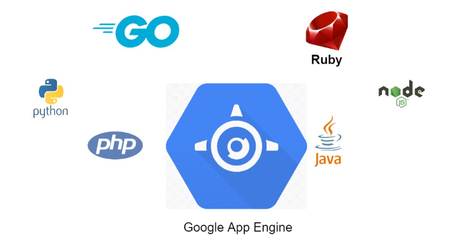

# Laboratorio 6: Despliegue de una Aplicación web en Python con App Engine

Bienvenido al laboratorio "Despliegue de una Aplicación web en Python con App Engine". En este laboratorio, aprenderás a desplegar una aplicación web escrita en Python utilizando Google App Engine en Google Cloud Platform (GCP). App Engine es un servicio completamente administrado que te permite implementar aplicaciones web y escalar automáticamente según la demanda de tráfico, sin tener que preocuparte por la administración de un servidor.

En este laboratorio, desplegaremos una aplicación web simple. Utilizaremos el framework Flask para crear nuestra aplicación web en Python.

App Engine nos permite enfocarnos en el desarrollo de nuestra aplicación sin preocuparnos por la infraestructura subyacente. Además, App Engine escala automáticamente nuestra aplicación en función del tráfico entrante, lo que garantiza que nuestra aplicación sea altamente disponible y pueda manejar cualquier carga de trabajo.

---

  

## Antes de comenzar
Antes de comenzar este laboratorio, es necesario que tengas una cuenta en GCP y conozcas los conceptos básicos de la plataforma.

## Objetivo
En este lab, aprenderás cómo desplegar una aplicación de Python en APP Engine, adicional también podrás aprender como probar la aplicación antes de ser desplegada desde el SDK de GCP.
  

## Instrucciones

Este Lab tiene dos modalidades: 

---
### Modalidad Paso a Paso

Ejecutar de forma manual cada una de las instrucciones, lo que permite visualizar y explorar el avance desde la consola. Para ello ejecuta los siguientes pasos:

### Habilitar la API de Google App Engine

Para habilitar el API de App Engine desde consola se deben de realizar los siguientes pasos:

1. En el menú de navegación de la izquierda, haz clic en APIs y servicios > Biblioteca.

2. Escribe "API de App Engine Admin" en el cuadro de búsqueda.

3. Haz clic en la tarjeta API de App Engine Admin.

4. Haz clic en Habilitar. Si no hay ninguna solicitud para habilitarla, significa que ya está habilitada y no deberás hacer nada.

O se puede habilitar desde el Cloud Shell con la siguiente instrucción :

`gcloud services enable appengine.googleapis.com --project=$GOOGLE_CLOUD_PROJECT`

### Descargar la app en python de ejemplo

1. Descarga la app de ejemplo con la siguiente instrucción

`git clone https://github.com/oscarhbo/GCP-Cloud-Labs.git`

2. Ir al directorio del código muestra 

`cd GCP-Cloud-Labs/Lab6_AppEngine/Hola_Mundo`

### Probar la Aplicación antes de Desplegar

Usaremos la utilidad dev_appserver.py incluida con el SDK de GCP, la cual nos sirve para probar de manera local simulando el entorno de App engine

1. ejecutar el siguiente comando 

  `dev_appserver.py app.yaml`

2. Para ver los resultados, hacer click en el icono de Web preview > Preview on port 8080.

### Desplegar la App

1. Con control-c parar la ejecución del dev_appserver 

2. Para desplegar la App hay que ir al directorio en donde esté la app con el archivo app.yaml 

`cd GCP-Cloud-Labs/Lab6_AppEngine/Hola_Mundo` 

3. Y ejecutar la siguiente instrucción:

`gcloud app deploy`

4. Para visualizar la aplicación ejecutar el comando

`gcloud app browse`

5. Si no se despliega la App dar click en el link que arroja en la consola

### Hacer un Cambio en la App 

1. ir al directorio en donde esté la el archivo main.py

`cd GCP-Cloud-Labs/Lab6_AppEngine/Hola_Mundo` 

2. editar el archivo y cambiar el mensaje de la app:

`nano main.py`

3. Desplegar nuevamente la aplicación

`gcloud app deploy`

4. Para visualizar la aplicación ejecutar el comando

`gcloud app browse`

5. Si no se despliega la App dar click en el link que arroja en la consola

Ahora podemos ver que se debe de haber desplegado la nueva versión de la App con los cambios realizados.

## ***¡Felicidades!***

Ahora ya has entendido como probar una Web App desde el SDK de GCP y la facilidad para desplegar esa misma app desde Google App Engine.

---
### Modalidad Automática

Ejecutar de forma automática mediante un shell script. Lo que permitirá ver el resultado del laboratorio, pero realizandolo de forma automática mediante un script. Para ello ejecuta los siguientes pasos:

1. Asegúrate de tener acceso a la CLI de GCP.
2. Abre la consola de cloud shell en GCP.
3. Clona este repositorio y accede a la carpeta "Lab5_Apllication_LB".
4. Ejecuta el script `create_app_engine.sh` para crear todos los recursos necesarios para probar el despliegue de la app.
5. Verifica que puedas accesar a la aplicación desplegada.

## Validaciones

Si se desea realizar las validaciones de forma automática, entonces sólo ejecutar el script `validar_lab.sh`

## Archivos
Este laboratorio incluye los siguientes archivos:
- `create_app_engine.sh`: script para crear los recursos necesarios para desplegar una aplicación en App Engine
- `validar_lab.sh`: Valida que se hayan completado los objetivos del lab correctamente
- `limpiar_lab.sh`: Este script ayuda e aliminar los recursos aprovisionados en este lab y evitar cargos extras en nuestra cuenta

---

## Ayuda de Comandos utilizados

 

---

## Conclusiones
Al finalizar este laboratorio, habrás aprendido a desplegar una aplicación web en Python utilizando Google App Engine en Google Cloud Platform (GCP). Y habrás aprendido que App Engine nos puede ser muy útil para implementar y escalar aplicaciones web de manera sencilla y eficiente.

